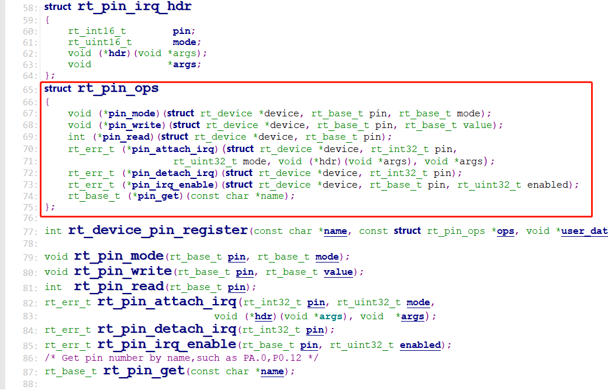

## 说明
RT-Thread提供PIN设备管理接口来访问GPIO，接口文件pin.c位于`rt-thread-master\rt-thread\components\drivers\misc`目录下，相关接口如下所示：
|      **函数**    |        **描述** |
|        :--       |        :--      |
| rt_pin_get()     |   获取引脚编号   |
| rt_pin_mode()    |   设置引脚模式   |
| rt_pin_write()   |   设置引脚电平   |
| rt_pin_read()    |   读取引脚电平   |
| rt_pin_attach_irq() | 绑定引脚中断回调函数 |
| rt_pin_irq_enable() | 使能引脚中断  |
| rt_pin_detach_irq() | 脱离引脚中断回调函数 |

## 流程分析
PIN设备驱动中按照同样的套路定义了PIN设备的操作方法，以回调函数的形式，然后在RT-Thread提供的硬件驱动文件`drv_gpio.c`中再一一实现这些回调函数；


GPIO的初始化流程为`rtthread_startup() -> rt_hw_board_init() -> rt_hw_pin_init()`,在rt_hw_pin_init()函数中先初始化GPIO时钟，然后调用`rt_device_pin_register()`函数注册PIN设备，在该函数中首先注册PIN设备操作方法的回调函数，然后调用`rt_device_register()`函数注册PIN设备。
```
// GPIO回调函数实例
const static struct rt_pin_ops _stm32_pin_ops = 
{
    stm32_pin_mode,
    stm32_pin_write,
    stm32_pin_read,
    stm32_pin_attach_irq,
    stm32_pin_dettach_irq,
    stm32_pin_irq_enable,
    stm32_pin_get,
};
```